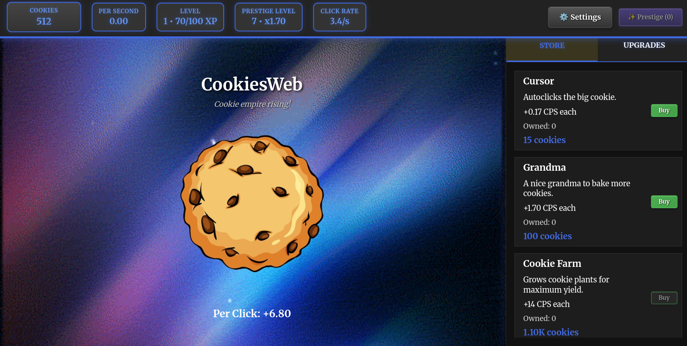

<h1 align="center">🍪 CookiesOnWeb</h1>

  Vanilla HTML/CSS/JS incremental "Cookie Clicker"-style game.

  

---

## ✨ Features

- 🍪 Big cookie button with floating +1 effect  
- 📊 Stats: total cookies and cookies per second (CPS)  
- 🔼 Multiple upgrades (10 tiers) with exponential costs  
- 🔓 Progressive unlocks and achievement messages  
- 💾 LocalStorage save/load with autosave and offline progress  
- 🌀 Optional prestige system with permanent multiplier  

---

## ▶️ Run

Open `index.html` in a browser. No build needed.

---
